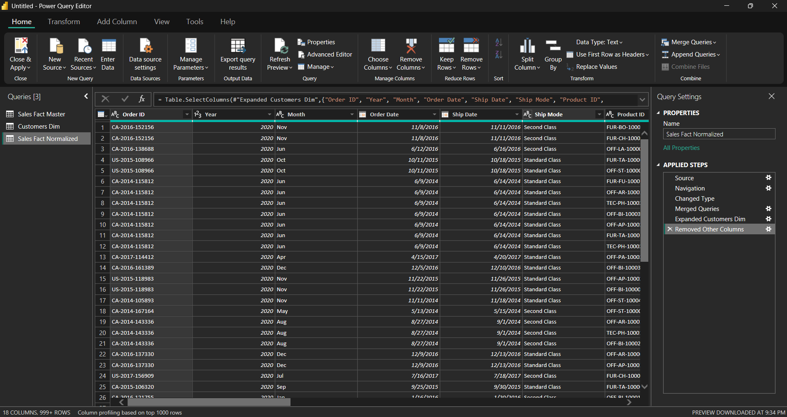
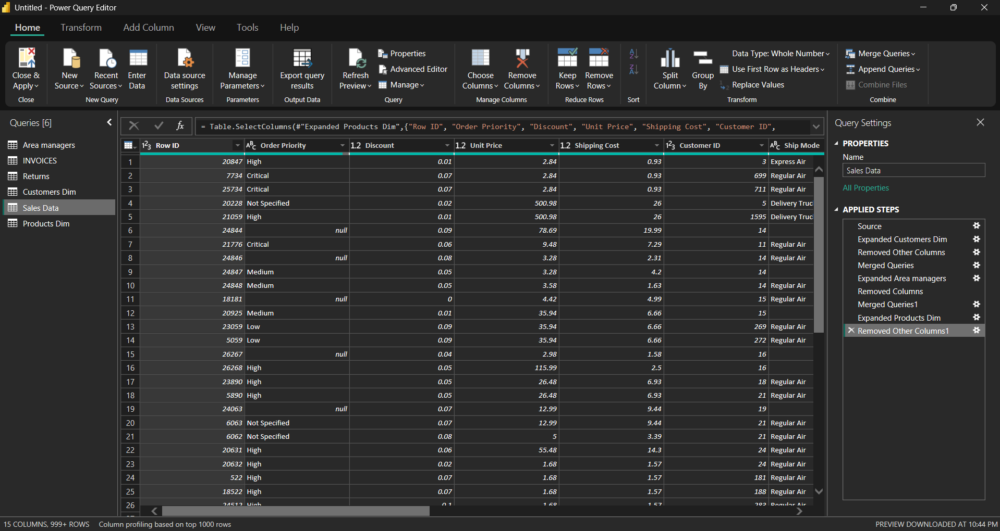
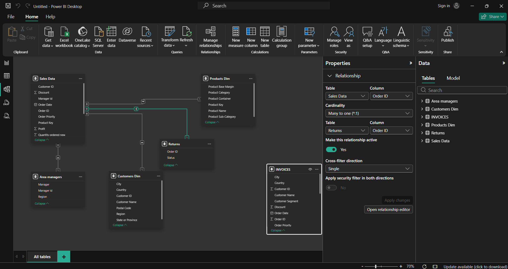
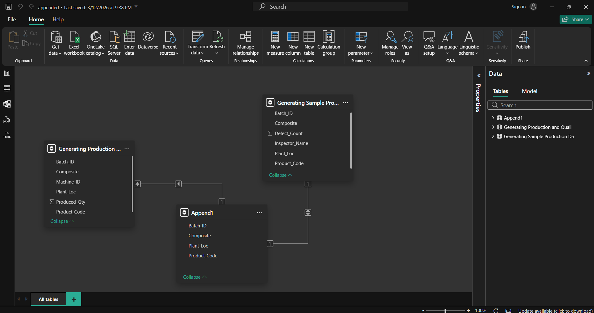

# 🚀 Power BI Performance Optimization: Normalization & Indexing

This repository demonstrates a technical case study on improving Power BI report responsiveness. By transitioning from a **Denormalized Flat Table** to a **Normalized Star Schema**, I achieved a significant reduction in visual load time and optimized the data architecture.

---

## 🧐 The Challenge
Using a "Master Table" (Flat Table) is a common beginner mistake that leads to:
* **Data Redundancy:** Repeated strings (Customer names, Categories) consume excess memory.
* **Slow DAX:** Calculations like `CALCULATE` or `SUMX` perform poorly on wide, flat tables.
* **Rendering Lag:** Visuals take longer to refresh as the engine scans unnecessary data.

---

## 🛠️ The Solution (Architecture)
Under the mentorship of **Eng. Ahmed Ali**, I implemented the following optimization workflow:

### 1. Data Transformation (Power Query)
I used Power Query to handle the ETL process, splitting the flat dataset into specialized **Dimension Tables** and a central **Fact Table**.

*Detailed transformation steps in Power Query to ensure data cleanliness.*

### 2. Normalization & Indexing
I generated unique Surrogate Keys (Indexing) to link tables efficiently, ensuring the model uses Integer keys instead of heavy String keys for relationships.

*Mapping out the transition from Flat to Normalized structure.*

### 3. Star Schema Design
The final model follows the **Star Schema** standard, which is the gold standard for Power BI's VertiPaq engine.

*Final Model View showing 1:Many relationships between Fact and Dimensions.*

---

## 📈 Performance Benchmarking (The Results)
To prove the efficiency of the new model, I used the **Performance Analyzer** to compare the rendering time of the same visual in both scenarios.

| Metric | Flat Table (Master) | Normalized (Star Schema) | Improvement |
| :--- | :---: | :---: | :---: |
| **Visual Rendering** | 172 ms | **131 ms** | **~24% Faster** |
| **Data Integrity** | Low | **High** | ✅ |

### Visual Proof:
| Before (Flat Table) - 172ms | After (Normalized) - 131ms |
| :---: | :---: |
|  |  |

---

## 🖼️ Project Gallery

### Power Query Applied Steps
Detailed look at how the data was shaped before loading into the model.

### Relationship Integrity
Ensuring all keys and cardinalities are correctly configured.

---

## 🧰 Tools & Technologies
* **Power BI Desktop:** For Modeling & DAX.
* **Power Query (M):** For ETL and Normalization.
* **Performance Analyzer:** For benchmarking and bottleneck identification.

---

## 🙏 Acknowledgments
Special thanks to **Eng. Ahmed Ali** for providing the technical foundation and professional insights into advanced data modeling and performance tuning.

---

## 📬 Contact
**Samir Hendawy** *Data Analyst & Analytics Engineer* [LinkedIn Profile](https://www.linkedin.com/in/samir-hendawy-699708298/) | [GitHub Portfolio](https://github.com/Samir-Hendawy)

---